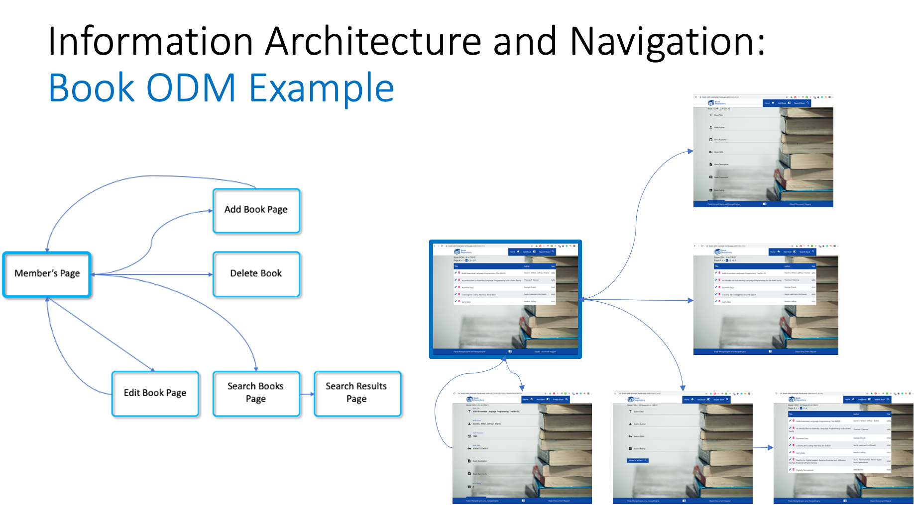

# Book Object Document Mapper Example using Flask-MongoEngine and MongoEngine

Using MongoEngine for MongoDB CRUD functions, and FlaskMongoEngine for Pagination, based on a simple Book database.

by [Naoise Gaffney - "Gaff"](https://github.com/NaoiseGaffney) for the Code Institute Learners pursuing a Diploma in Full Stack Development



[Book ODM on Heroku](https://book-odm-prod.herokuapp.com/)

[Book ODM GitHub Repository](https://github.com/NaoiseGaffney/BookODM)

## Outcomes

* ODM CRUD Functions using MongoEngine for MongoDB for Your MS3 or On-the-Job.
* Pagination, Flask DebugToolbar, Session Cookies.
* Configure a CDD Workflow.

## Assumptions

Some experience with GitHub, Visual Studio Code, and Heroku (helpful, not essential) as well as Flask and Templates.

## Agenda

1. Overview.
2. Book ODM Example
	*	Initial Setup, Minimum Viable Flask, and 	     CDD Workflow
	* MongoDB and Flask-MongoEngine / 		     MongoEngine
	* Book Class
	* Flask Templates and CRUD
	* Flask DebugToolbar
	* Pagination
	* Search, Pagination, and Session
3. Summary

## Code

### Python, Flask, Flask-MongoEngine/MongoEngine

```

import os
from flask import Flask
import gunicorn
from flask_mongoengine import MongoEngine
import datetime
from flask import Flask, render_template, redirect, url_for, request, flash, session

from dotenv import load_dotenv
from pathlib import Path
env_path = Path(".") / ".env"
load_dotenv(dotenv_path=env_path)

# FDT Extension Load IF FDT == ON.
if os.environ.get("FDT") == "ON":
    from flask_debugtoolbar import DebugToolbarExtension

app = Flask(__name__, static_folder="static", template_folder="templates")
app.config["SECRET_KEY"] = os.environ.get("SECRET_KEY")

# FDT Extension app.debug = True IF FDT == ON.
if os.environ.get("FDT") == "ON":
    app.debug = True

# Flask-MongoEngine settings
MONGO_URI_BOOKODM = os.environ.get("MONGO_URI_BOOKODM")
app.config["MONGODB_SETTINGS"] = {
    'host': MONGO_URI_BOOKODM
}
db = MongoEngine(app)

# FDT Extension App IF FDT == ON.
if os.environ.get("FDT") == "ON":
    toolbar = DebugToolbarExtension(app)


class Book(db.Document):
    title = db.StringField(default="", maxlength=250)
    author = db.StringField(default="", maxlength=250)
    year = db.IntField(maxlength=4)
    ISBN = db.IntField(maxlength=13)
    short_description = db.StringField(default="", maxlength=2000)
    user = db.StringField(required=True, default="BookODM")
    creation_date = db.DateTimeField(default=datetime.datetime.now)
    comments = db.StringField(default="", maxlength=3500)
    rating = db.IntField(choices=[1, 2, 3, 4, 5, 6, 7, 8, 9, 10])
    genre = db.StringField(default="")
    private_view = db.StringField(default="off")
    book_thumbnail = db.StringField(default="")

    meta = {
        "auto_create_index": True,
        "index_background": True,
        "indexes": ["title"],
        "ordering": ["title"]
    }


@app.route("/")
@app.route("/index")
@app.route("/index.html")
@app.route("/index.html/<int:page>")
def home_page(page=1):
    """
    The "R" in CRUD, a virtual library or stack of books to browse.
    """
    # books_pagination = Book.objects()
    books_pagination = Book.objects.paginate(page=page, per_page=5)
    # print(books_pagination.count())
    return render_template("index.html", books_pagination=books_pagination, page_prev=(page - 1), page_next=(page + 1))


@app.route("/add_book")
def add_book():
    """
    Preparing for the "C" in CRUD, filling in the add book form.
    """
    return render_template("add_book.html")


@app.route("/save_book", methods=["POST"])
def save_book():
    """
    The "C" in CRUD, save the filled in add book form.
    """
    book = Book(
        title=request.form.get("title"),
        author=request.form.get("author"),
        year=request.form.get("year"),
        ISBN=request.form.get("isbn"),
        short_description=request.form.get("short_description"),
        comments=request.form.get("comments"),
        rating=request.form.get("rating"),
        genre=request.form.get("genre"),
        private_view=request.form.get("private_view")
    )

    try:
        book.save()
        flash("The book was saved!", "success")
    except Exception:
        flash("The book was NOT saved!", "danger")
    return redirect(url_for("home_page"))


@app.route("/edit_book/<book_id>")
def edit_book(book_id):
    """
    Preparing for the "U" in CRUD, updating the book form fields.
    """
    book = Book.objects.get(id=book_id)
    return render_template("edit_book.html", book=book)


@app.route("/update_book/<book_id>", methods=["POST"])
def update_book(book_id):
    """
    The "U" in CRUD, saving the changes made to the update book form fields.
    """
    book = Book.objects.get(id=book_id)
    fields = {
        "title": request.form.get("title"),
        "author": request.form.get("author"),
        "year": request.form.get("year"),
        "ISBN": request.form.get("isbn"),
        "short_description": request.form.get("short_description"),
        "comments": request.form.get("comments"),
        "rating": request.form.get("rating"),
        "genre": request.form.get("genre"),
        "private_view": request.form.get("private_view")
    }

    if fields["private_view"] != "on":
        fields["private_view"] = "off"

    try:
        book.update(**fields)
        flash("The book is updated!", "success")
    except Exception:
        flash("The book was NOT updated!", "danger")
    return redirect(url_for("home_page"))


@app.route("/delete_book/<book_id>")
def delete_book(book_id):
    """
    The "D" in CRUD, deleting the book based on 'id'.
    """
    book = Book.objects.get(id=book_id)

    try:
        book.delete()
        flash("The book is deleted!", "success")
    except ReferenceError:
        pass
    except Exception:
        flash("The book was NOT deleted!", "danger")

    return redirect(url_for("home_page"))


@app.route("/search_book")
def search_book():
    """
    Preparing for the book search, filling in the search book form.
    """
    return render_template("search_book.html")


@app.route("/save_search", methods=["GET", "POST"])
def save_search():
    """
    Save the search book results in a session cookie, to use by 'search_results' repeatedly to display the paginated search results.
    """
    fields = {
        "title": request.form.get("title"),
        "author": request.form.get("author"),
        "year": request.form.get("year"),
        "ISBN": request.form.get("isbn"),
        "short_description": request.form.get("short_description"),
        "comments": request.form.get("comments"),
        "rating": request.form.get("rating"),
        "genre": request.form.get("genre"),
        "private_view": request.form.get("private_view")
    }
    session["fields"] = fields
    return redirect(url_for("search_results"))


@app.route("/search_results", methods=["GET", "POST"])
@app.route("/search_results/<int:page>")
def search_results(page=1):
    """
    Book search using a combination of form fields saved in the session cookie in 'save_search', and based on the values in some key fields
    decide which Book Repository BaseQuerySet to run. As all form fields are returned as strings, the integer fields must be converted to
    integers before being used. In case of errors they are caught as exceptions and set to valid values. There are 6 BaseQuerySets.
    """
    fields = session.get("fields")

    form_title = fields["title"]
    form_author = fields["author"]
    try:
        form_isbn = int(fields["ISBN"])
    except ValueError:
        form_isbn = 0
    except TypeError:
        form_isbn = 0
    try:
        form_rating = int(fields["rating"])
    except ValueError:
        form_rating = 1
    except TypeError:
        form_rating = 0
    form_genre = fields["genre"]
    form_private_view = fields["private_view"]

    # Query Book Repository based on the search form data
    # Private Search "form_private_view == "on"
    if form_private_view == "on":
        if form_isbn:
            # book_query_results = Book.objects.filter(user=current_user.username, ISBN=form_isbn)
            book_query_results = Book.objects.filter(ISBN=form_isbn)
            book_query_results = book_query_results.paginate(page=page, per_page=7)
            return render_template("search_results.html", book_query_results=book_query_results, page_prev=(page - 1), page_next=(page + 1))
        elif form_genre is None:
            # book_query_results = Book.objects.filter(user=current_user.username, title__icontains=form_title, author__icontains=form_author, rating__gte=form_rating).order_by("+title", "+author", "-rating")
            book_query_results = Book.objects.filter(title__icontains=form_title, author__icontains=form_author, rating__gte=form_rating).order_by("+title", "+author", "-rating")
            book_query_results = book_query_results.paginate(page=page, per_page=7)
            return render_template("search_results.html", book_query_results=book_query_results, page_prev=(page - 1), page_next=(page + 1))
        else:
            # book_query_results = Book.objects.filter(user=current_user.username, title__icontains=form_title, author__icontains=form_author, rating__gte=form_rating, genre=form_genre).order_by("+title", "+author", "-rating")
            book_query_results = Book.objects.filter(title__icontains=form_title, author__icontains=form_author, rating__gte=form_rating, genre=form_genre).order_by("+title", "+author", "-rating")
            book_query_results = book_query_results.paginate(page=page, per_page=7)
            return render_template("search_results.html", book_query_results=book_query_results, page_prev=(page - 1), page_next=(page + 1))
    # Public Search "form_private_view == None"
    else:
        if form_isbn:
            book_query_results = Book.objects.filter(ISBN=form_isbn, private_view="off")
            book_query_results = book_query_results.paginate(page=page, per_page=7)
            return render_template("search_results.html", book_query_results=book_query_results, page_prev=(page - 1), page_next=(page + 1))
        elif form_genre is None:
            book_query_results = Book.objects.filter(title__icontains=form_title, author__icontains=form_author, rating__gte=form_rating, private_view="off").order_by("+title", "+author", "-rating")
            book_query_results = book_query_results.paginate(page=page, per_page=7)
            return render_template("search_results.html", book_query_results=book_query_results, page_prev=(page - 1), page_next=(page + 1))
        else:
            book_query_results = Book.objects.filter(title__icontains=form_title, author__icontains=form_author, rating__gte=form_rating, genre=form_genre, private_view="off").order_by("+title", "+author", "-rating")
            book_query_results = book_query_results.paginate(page=page, per_page=7)
            return render_template("search_results.html", book_query_results=book_query_results, page_prev=(page - 1), page_next=(page + 1))


if __name__ == "__main__":
    if os.environ.get("APPDEBUG") == "ON":
        app.run(host=os.environ.get("IP"),
                port=os.environ.get("PORT"), debug=True)
    else:
        app.run(host=os.environ.get("IP"),
                port=os.environ.get("PORT"), debug=False)
```
